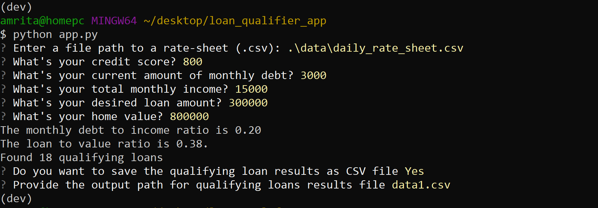

# Ability to save and share the qualifying loans to a CSV file

This assignment is an enhancement to qualiying loans app. The purpose is to add an ablility to save the results of qualifying loan to csv file and be able to share the results as a spreedsheet.

The qualifiying loans app(app.py) uses python 3.9 command line interface and two libraries i.e fire and questionary. This application uses bank data provided in daily_rate_sheet csv along with information keyed in by the user such as credit_score, income, debt, home_value, desired_loan and returns list of qualifying loans. However, if no qualiying loans exist, then program notify user and exit.

## Technologies

This project leverages python 3.9 with the following packages:

* [fire](https://github.com/google/python-fire) - For the command line interface, help page, and entry-point.

* [questionary](https://github.com/tmbo/questionary) - For interactive user prompts and dialogs

---

## Installation Guide

Before running the application first install the following dependencies.

```python
  pip install fire
  pip install questionary
```

## Usage

Saving Qualifying loans

The application genrates list of qualifying loans and prompt user with an option to save as an csv file and to provide path to save the file. To achieve this functionality following code has been added.

```python
def save_qualifying_loans(qualifying_loans):
    save_information = questionary.confirm("Do you want to save the qualifying loan results as CSV file").ask()
    
    if save_information:
        path_to_save_file = questionary.text("Provide the output path for qualifying loans results file").ask()
        header =["Lender","Max Loan Amount","Max LTV","Max DTI","Min Credit Score", "Interest Rate"]

        save_csv(Path(path_to_save_file),qualifying_loans,header)

def save_csv(csvpath, data, header=None):
    """Saves the CSV file from path provided.

    Args:
        csvpath (Path): The CSV file path.
        data (list of lists): A list of the rows of data for the CSV file.
        header (list): An optional header for the CSV.

    """
    with open(csvpath, "w", newline="") as csvfile:
        csvwriter = csv.writer(csvfile, delimiter=',')
        if header:
            csvwriter.writerow(header)
        csvwriter.writerows(data)
```

 In case, if there are no qualifying loans, the program exits. To achive this following code is add to run function:

 ``` Save qualifying loans
    if qualifying_loans:
        save_qualifying_loans(qualifying_loans)
    else:
        sys.exit("No qualifying loans found")
```

## Output Example



## Contributors

Brought to you by Amrita Prithiani

## License

MIT
